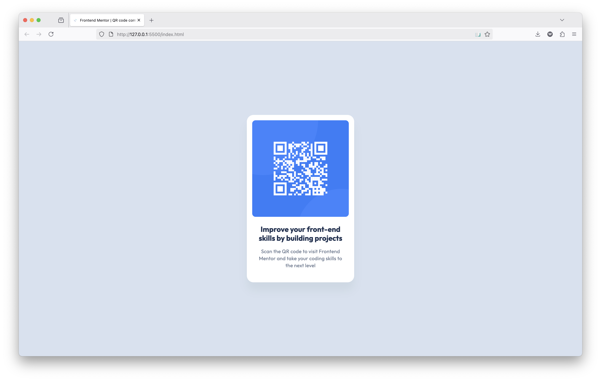

# Frontend Mentor - QR code component solution

This is a solution to the [QR code component challenge on Frontend Mentor](https://www.frontendmentor.io/challenges/qr-code-component-iux_sIO_H).

## Table of contents

- [Overview](#overview)
  - [Screenshot](#screenshot)
  - [Links](#links)
- [My process](#my-process)
  - [Built with](#built-with)
  - [What I learned](#what-i-learned)
  - [Continued development](#continued-development)
  - [Useful resources](#useful-resources)
- [Author](#author)
- [Acknowledgments](#acknowledgments)

## Overview

### Links

- Solution: [Github](https://github.com/willdelorm/qr-code-component)
- Live Site: [Github Pages](https://willdelorm.github.io/qr-code-component/)

## My process

### Built with

- Semantic HTML5 markup
- CSS custom properties
- Flexbox

### What I learned

For this project, I focused on making this card component easily reusable. Instead of using element selectors, I gave everything a class name that can be easily transferred between projects.

I organized typography and colors into dedicated classes and variables. Taking a page out of frameworks like Tailwind, this allows easy updates in the future without needing to comb through the full project for every instance of a color/font.

### Continued development

For such a simple project, it can be easy to fall back on using a series of `div` elements. I attempted to use more semantic HTML tags, but I would like to keep working on incorporating them in future projects. This will improve both my own organizational practices and readibility for screen readers.

## Author

- Website - [Will Delorm](https://willdelorm.com)
- Frontend Mentor - [@willdelorm](https://www.frontendmentor.io/profile/willdelorm)

## Thanks!

Thanks for checking out my project. If you have any questions or suggestions, feel free to reach out!